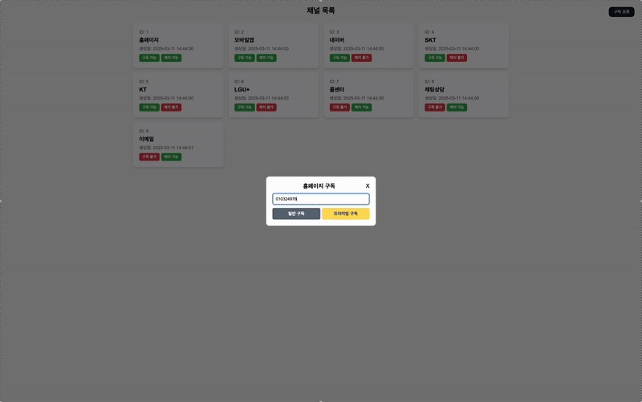
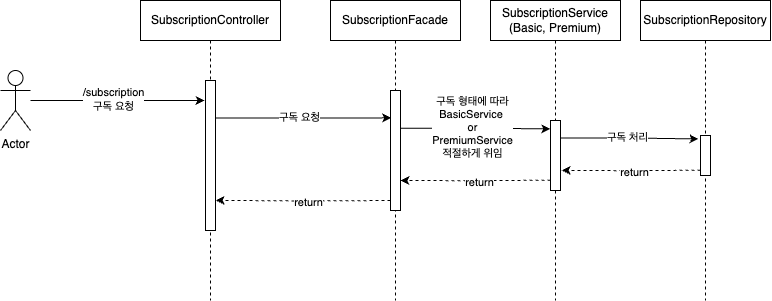
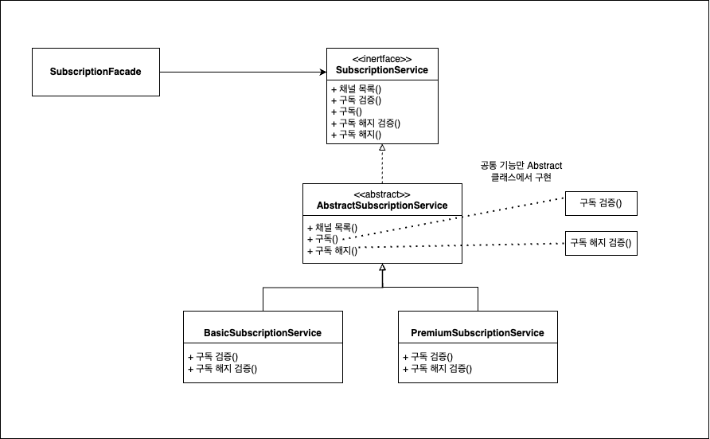
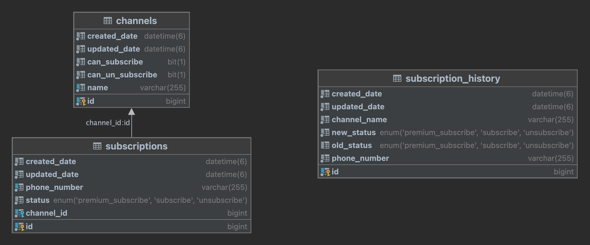

# Artinus 과제 수행 (백엔드 지원자 김대현)

| 사용 기술       | 버전     |
|-------------|--------|
| Spring Boot | 3.4.3  |
| Java        | 17     |
| Mysql       | 8.0.41 |
| QueryDsl    | 5.0.0  |

| IDE      |
|----------|
| IntelliJ |

## Demo URL

| url                   | https://artinus.tonglink.site  |
|-----------------------|--------------------------------|

# 시연 영상


# application-dev.yml 수정
```yml
## 해당부분 실제 DB접속 주소로 설정 후 빌드
spring:  
  datasource:
    url: ${DB_URL:jdbc:mysql://host/database}
    username: ${DB_USERNAME:username}
    password: ${DB_PASSWORD:password}
```

# Docker Build
```shell
./gradlew bootJar
docker build --platform linux/amd64 -t altinustask:darren-0.0.1 .
docker run -d -p 8086:8080 altinustask:darren-0.0.1
```

# Jar Build
```shell
./gradlew bootJar
java -jar build/libs/Artinus-darren-0.0.1.jar
```


# 패키지 구조 (Layered Architecture)
```text
com.altinus
│── common                  # 공통 기능 (예외 처리, 인터셉터, 응답 처리 등)
│   ├── exception
│   │   ├── ... 
│   ├── interceptor
│   │   ├── ...
│   ├── response
│   │   ├── ...
│── subscription            # 구독 도메인
│   ├── application         # 비즈니스 로직 (Use Case)
│   │   ├── dto
│   │   │   ├── request
│   │   │   │   ├── SubscriptionCreateRequestDto.java   # 서비스 Layer에서 파라미터로 받는 DTO
│   │   │   ├── response
│   │   │   │   ├── SubscriptionResponseDto.java        # 서비스 Layer에서 결과값 반환 DTO
│   │   ├── converter
│   │   │   ├── SubscriptionConverter.java              # 각 Layer별 DTO 변환용 컨버터 클래스
│   │   ├── service
│   │   │   ├── SubscriptionService.java                # 인터페이스   
│   │   │   ├── AbstractSubscriptionService.java        # 추상 클래스
│   │   │   ├── impl
│   │   │   │   ├── BasicSubscriptionService.java       # 서비스 구현체
│   │   │   │   ├── PremiumSubscriptionService.java     # 서비스 구현체
│   │   ├── SubscriptionFacade.java                     # 퍼사드 패턴
│   ├── domain                                          # 도메인 모델
│   │   ├── common                                      # 공통 사용
│   │   │   ├── SubscriptionStatus.java
│   │   │   ├── SubscriptionDSLRepository.java
│   │   ├── subscription                                # 구독 도메인
│   │   │   ├── Subscription.java
│   │   │   ├── SubscriptionRepository.java
│   │   ├── channel                                     # 채널 도메인
│   │   │   ├── Channel.java
│   │   │   ├── ChannelRepository.java
│   │   ├── history                                     # 구독 이력 도메인
│   │   │   ├── SubscriptionHistory.java
│   │   │   ├── SubscriptionHistoryRepository.java
│   ├── infrastructure                                  # 영속성, QueryDSL, 외부 API 연동
│   │   ├── external                                    # 외부 API
│   │   │   ├── dto
│   │   │   │   ├── CsrngResponseDto.java
│   │   │   ├── service
│   │   │   │   ├── CsrngExternalService.java 
│   │   ├── repository
│   │   │   ├── SubscriptionDSLRepositoryImpl.java      # QueryDSL 구현체
│   ├── ui                  # API 레이어
│   │   ├── dto 
│   │   │   ├── request
│   │   │   │   ├── SubscriptionCreateRequestApiDto.java #View Layer에서 사용할 DTO
│   │   │   ├── response
│   │   │   │   ├── SubscriptionCreateResponseApiDto.java #View Layer에서 사용할 DTO
│   │   ├── SubscriptionController.java
│   │   ├── ChannelController.java
│── view            # Demo를 위한 ThymeLeaf 디렉토리
│   ├── ViewController.java
│── AltinusApplication.java  # 메인 클래스
```

# 구독하기 (Sequence Diagram) 


# 확장성을 고려해 Template Method Pattern & Facade Pattern 활용


* Facade를 통해 서비스 내부 구조를 몰라도 구독 처리 가능하도록 하였습니다. 앞으로 서비스가 많아질텐데 이를 Controller에서 관리하지 않고 퍼사드로 묶어서 관리하도록 했습니다.
* Facade는 인터페이스 형태인 SubscriptionService를 바라보도록하여 느슨한 결합도를 유지했습니다.
* 만약 Basic, Primium외에 새로운 구독 형태가 추가될 가능성이 있다고 판단하여 각 구독형태 검증에 대해서 구현체로 뺐습니다. 이로 인해서 새로운 구독 형태가 추가될 때 기존 코드의 변경을 최소화하였습니다.
* 또한 템플릿 메서드를 이용하여 구독과 구독 취소의 공통 기능(ex: DB조회 및 Save로직) 은 추상클래스에서 구현하였고, 이를 뼈대로 잡아 구현체에서 구현할 메서드는 호출하는 형식으로 구현했습니다.

```java
    /**
     * 구독하기 로직
     *
     * @param subscriptionCreateRequestDto
     * @return SubscriptionResponseDto
     */
    @Override
    @Transactional
    public SubscriptionResponseDto subscribe(SubscriptionCreateRequestDto subscriptionCreateRequestDto) {
        // 1. 채널 DB 데이터 조회
        log.info("[구독 시작]");
        log.info("[구독] 1. 채널 DB 데이터 조회 {} => {}", subscriptionCreateRequestDto.getPhoneNumber(), subscriptionCreateRequestDto.getChannelId());
        Channel channelEntity = channelRepository.findById(subscriptionCreateRequestDto.getChannelId())
                .orElseThrow(() -> new ApiErrorException(ResultCode.NOT_FOUND));

        if(!channelEntity.getCanSubscribe()) {
            throw new ApiErrorException(ResultCode.DISABLED_SUBSCRIBE);
        }

        beforeSubscribe();

        // 2. 구독 여부 확인
        // 각각 구현체에서 구현
        log.info("[구독] 2. 구독 여부 확인");
        ValidateSubscriptionResponseDto validateSubscriptionResponseDto = validateSubscribe(
                subscriptionCreateRequestDto.getPhoneNumber(),
                channelEntity,
                subscriptionCreateRequestDto.getStatus()
                );

        // 3. 구독 - validateSubscriptionResponseDto.getId() 로 JPA의 더티체킹
        Subscription subscriptionEntity = new Subscription(
                validateSubscriptionResponseDto.getId(),
                validateSubscriptionResponseDto.getPhoneNumber(),
                validateSubscriptionResponseDto.getNewStatus(),
                validateSubscriptionResponseDto.getChannel()
        );
        subscriptionRepository.save(subscriptionEntity);
        log.info("[구독] 3. 구독 {} => {}", validateSubscriptionResponseDto.getPhoneNumber(), validateSubscriptionResponseDto.getChannel().getName());

        // 4. 구독 내역 저장
        SubscriptionHistory newSubscriptionHistory = new SubscriptionHistory(
                validateSubscriptionResponseDto.getPhoneNumber(),
                validateSubscriptionResponseDto.getOldStatus(),
                validateSubscriptionResponseDto.getNewStatus(),
                validateSubscriptionResponseDto.getChannel().getName()
        );
        subscriptionHistoryRepository.save(newSubscriptionHistory);
        log.info("[구독] 4. 구독 이력 {} => {}", validateSubscriptionResponseDto.getOldStatus(), validateSubscriptionResponseDto.getNewStatus());

        // 5. 외부 API 호출
        callAltinusSubscribe();
        log.info("[구독 완료]");

        afterSubscribe();
        return subscriptionConverter.toSubscriptionResponseDto(subscriptionEntity, channelEntity);
    }
```
다음 처럼 subscribe() 내부에 abstract method를 호출하였습니다. 

beforeSubscribe(), validateSubscribe(), afterSubscribe()

```java
@Slf4j
@Service("basicSubscriptionService")
@Primary
public class BasicSubscriptionService extends AbstractSubscriptionService {


    public BasicSubscriptionService(ChannelRepository channelRepository,
                                    SubscriptionRepository subscriptionRepository,
                                    SubscriptionHistoryRepository subscriptionHistoryRepository,
                                    SubscriptionDSLRepository subscriptionDSLRepository,
                                    ChannelConverter channelConverter,
                                    SubscriptionConverter subscriptionConverter,
                                    SubscriptionHistoryConverter subscriptionHistoryConverter,
                                    CsrngExternalService csrngExternalService) {
        super(  channelRepository,
                subscriptionRepository,
                subscriptionHistoryRepository,
                subscriptionDSLRepository,
                channelConverter,
                subscriptionConverter,
                subscriptionHistoryConverter,
                csrngExternalService
        );
    }

    @Override
    public void beforeSubscribe() {
        //TODO 결제 등등 구현체 적용
    }

    @Override
    public void afterSubscribe() {
        //TODO 결제 등등 구현체 적용
    }

    @Override
    public void beforeUnSubscribe() {
        //TODO 결제 등등 구현체 적용
    }

    @Override
    public void afterUnSubscribe() {
        //TODO 결제 등등 구현체 적용
    }

    /**
     * ValidateSubscriptionResponseDto 기준으로 Subscription, History 저장 또는 변경
     * @param phoneNumber   구독자 전화번호
     * @param channel       구독할 채널
     * @param newStatus     변경할 구독 상태
     * @return
     * ValidateSubscriptionResponseDto.class
     * id: 수정할 SubscriptionId, null일 경우 새로 생성
     * phoneNumber: 구독자 전화번호
     * oldStatus: 기존 구독 상태 (신규 구독시 UNSUBSCRIBE 고정)
     * newStatus: 변경할 구독 상태
     * channel: 구독할 채널
     */
    @Override
    public ValidateSubscriptionResponseDto validateSubscribe(String phoneNumber, Channel channel, SubscriptionStatus newStatus) {
        log.info("[Basic 구독]");
        return subscriptionConverter.toValidateSubResponseDto(null, phoneNumber, channel, SubscriptionStatus.UNSUBSCRIBE, newStatus);
    }

    /**
     * ValidateSubscriptionResponseDto 기준으로 Subscription, History 삭제 또는 변경
     * @param phoneNumber   구독자 전화번호
     * @param channel       구독할 채널
     * @param newStatus     변경할 구독 상태
     * @return
     * ValidateSubscriptionResponseDto.class
     * id: 수정 및 삭제할 SubscriptionId
     * phoneNumber: 구독자 전화번호
     * oldStatus: 기존 구독 상태
     * newStatus: 변경할 구독 상태
     * channel: 구독할 채널
     */
    @Override
    public ValidateUnSubscriptionResponseDto validateUnSubscribe(String phoneNumber, Channel channel, SubscriptionStatus newStatus, SubscriptionDto subscriptionDto) {
        log.info("[Basic 구독 해지]");
        return subscriptionConverter.toValidateUnSubResponseDto(subscriptionDto.getId(), phoneNumber, channel, subscriptionDto.getStatus(), newStatus);
    }
}

```
해당 추상 메서드들은 각 구현체에서 구현하여 느슨한 결합도를 유지했습니다.

# Database

JPA Entity 설계를 진행했으며, 회원은 단순히 전화번호로만 구분을 하였고, channels(1) : subscriptions(N) 의 관계 로 설계를 진행하였습니다.

subscription_history의 경우 그 당시 내역만을 저장하기 위해 외래키를 걸지 않고 그 당시의 채널 명을 저장하는 것으로 진행했습니다.

## Channel Enttiy
```java
@Getter
@AllArgsConstructor
@NoArgsConstructor
@Entity
@Table(name = "channels")
public class Channel extends BaseEntity {
    @Id
    @GeneratedValue(strategy = GenerationType.IDENTITY)
    private Long id;

    @Column(nullable = false, unique = true)
    private String name;

    @Column(nullable = false)
    private Boolean canSubscribe;

    @Column(nullable = false)
    private Boolean canUnSubscribe;

    public Channel(String name, Boolean canSubscribe, Boolean canUnSubscribe) {
        this.name = name;
        this.canSubscribe = canSubscribe;
        this.canUnSubscribe = canUnSubscribe;
    }

}
```

## Subscription Entity
```java
@Getter
@AllArgsConstructor
@NoArgsConstructor
@DynamicUpdate
@DynamicInsert
@Entity
@Table(
        name = "subscriptions",
        uniqueConstraints = {
                @UniqueConstraint(name = "UK_phone_channel", columnNames = {"phoneNumber", "channel_id"})
        },
        indexes = {
                @Index(name = "IDX_subscription_channel", columnList = "channel_id") // FK 인덱스 추가
        }
)
public class Subscription extends BaseEntity {

    @Id
    @GeneratedValue(strategy = GenerationType.IDENTITY)
    private Long id;

    @Column(nullable = false)
    private String phoneNumber;  // 회원 ID 없이, 휴대폰 번호로 관리

    @Enumerated(EnumType.STRING)
    @Column(nullable = false)
    private SubscriptionStatus status;

    @ManyToOne(fetch = FetchType.LAZY)
    @JoinColumn(name = "channel_id", nullable = false)
    private Channel channel;

    public Subscription(String phoneNumber, Channel channel, SubscriptionStatus status) {
        this.phoneNumber = phoneNumber;
        this.channel = channel;
        this.status = status;
    }

    public void subscribeChannel(Channel channel) {
        this.channel = channel;
    }


    public void updateStatus(SubscriptionStatus newStatus) {
        this.status = newStatus;
    }
}
```

Channel에서는 Subscription이 자주 조회되지 않다고 판단하여 @OneToMany 조건을 걸지 않았으며, Subscription쪽에 @ManyToOne 만 걸어주었습니다.

또한 save() 나 delete() 만 Spring Data Jpa를 활용하며 그 외에는 복잡한 쿼리는 QueryDsl로 join을 수행해 N+1문제를 방지하였습니다.

그 외에 구독이 여러번 되는 경우를 막기 위해 (phoneNumber, channelId) 를 복합 유니크키를 걸어 데이터의 무결성을 유지하였습니다.

또한 외래키에 대해 인덱싱을 걸어 조회시 성능을 향상시켰습니다.